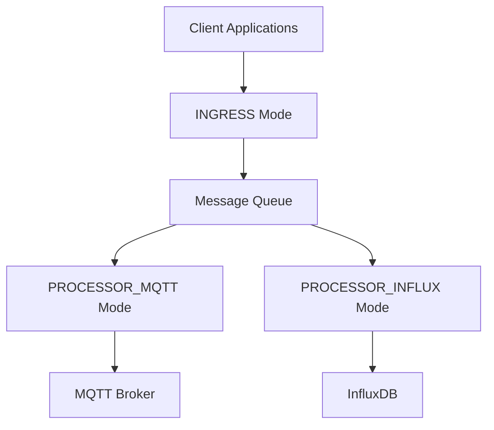

<div align="center">
  

  # logreposit-api

  **Unified monitoring platform for time-series data collection and processing**
</div>

| Branch      |                                                                          Build Status                                                                          |                                                                        Code Coverage                                                                         |
|-------------|:--------------------------------------------------------------------------------------------------------------------------------------------------------------:|:------------------------------------------------------------------------------------------------------------------------------------------------------------:|
| **master**  |  [](https://circleci.com/gh/logreposit/logreposit-api/tree/master)  |  [](https://codecov.io/gh/logreposit/logreposit-api/branch/master)  |
| **develop** | [](https://circleci.com/gh/logreposit/logreposit-api/tree/develop) | [](https://codecov.io/gh/logreposit/logreposit-api/branch/develop) |

---

TODO: Update ToC accordingly

## Table of Contents

- [📋 Service Description](#-service-description)
- [🏗️ Architecture](#️-architecture)
- [🚀 Quick Start](#-quick-start)
  - [📋 Prerequisites](#-prerequisites)
  - [🎯 All-in-One Deployment](#-all-in-one-deployment)
- [⚙️ Configuration Reference](#️-configuration-reference)
- [🔌 API Usage](#-api-usage)
- [🏥 Health Monitoring](#-health-monitoring)
- [🛠️ Troubleshooting](#️-troubleshooting)
- [🤝 Contributing](#-contributing)
- [📜 License](#-license)

---

## 📋 Service Description

Logreposit API is a **unified monitoring platform** for collecting and processing time-series data from various sources including:

| Source Type                | Examples                 | Use Cases                                                |
|----------------------------|--------------------------|----------------------------------------------------------|
| **Energy Systems**         | Photovoltaic systems     | energy efficiency                                        |
| **Heating Systems**        | heating controllers      | energy efficiency, problem debugging, proactive alerting |
| **Smart Home Devices**     | IoT sensors, thermostats | Home automation, climate control                         |
| **Industrial Controllers** | Equipment monitoring     | Multi-location device monitoring                         |

### Key Features
- 🚀 **REST API endpoints** for data ingestion and device/user management
- 🔄 **Real-time MQTT** support for streaming data
- 📊 **Time-series storage** with InfluxDB backend
- 📈 **Grafana dashboards** for visualization and alerting

## 🏗️ Architecture

This service supports **three operational modes** that can be enabled independently:



| Mode                      | Description               | Purpose                               |
|---------------------------|---------------------------|---------------------------------------|
| 🌐 **INGRESS**            | REST API endpoints        | Data collection and device management |
| 📡 **PROCESSOR_MQTT**     | MQTT message processing   | Real-time data streaming              |
| 🗄️ **PROCESSOR_INFLUX**  | Time-series storage       | InfluxDB data persistence             |

For **production-grade setups**, you should run different modes in separate deployments. 
The `logreposit-api` contains everything, but using the `APP_MODES_ENABLED` environment variable, you can control which 
components are loaded on startup. See the "Configuration Reference" section below. (TODO: Add anchor/link)

## 🚀 Quick Start

### 📋 Prerequisites

| Requirement                           | Version | Purpose                                                      |
|---------------------------------------|---------|--------------------------------------------------------------|
| 🐳 **Container Orchestration Engine** | -       | Container orchestration engine such as docker-compose or k8s |
| ☕ **Java**                            | 21+     |                                                              |

### 🎯 All-in-One Deployment

TODO: Forward to md file in some "example" directory ..

## ⚙️ Configuration Reference

### 🎛️ Application Modes

Configure which components to enable:

| Environment Variable | Default                                   | Description                             |
|----------------------|-------------------------------------------|-----------------------------------------|
| `APP_MODES_ENABLED`  | `ingress,processor_mqtt,processor_influx` | Comma-separated list of modes to enable |

Available modes:
- `ingress` - REST API endpoints for data collection
- `processor_mqtt` - MQTT message processing
- `processor_influx` - InfluxDB integration

### 🔗 Core Dependencies

| Environment Variable           | Default         | Description           |
|--------------------------------|-----------------|-----------------------|
| `SPRING_DATA_MONGODB_HOST`     | `localhost`     | MongoDB hostname      |
| `SPRING_DATA_MONGODB_PORT`     | `27017`         | MongoDB port          |
| `SPRING_DATA_MONGODB_DATABASE` | `logrepositapi` | MongoDB database name |
| `SPRING_RABBITMQ_HOST`         | `localhost`     | RabbitMQ hostname     |
| `SPRING_RABBITMQ_PORT`         | `5672`          | RabbitMQ port         |
| `SPRING_RABBITMQ_USERNAME`     | `guest`         | RabbitMQ username     |
| `SPRING_RABBITMQ_PASSWORD`     | `guest`         | RabbitMQ password     |

### 🗄️ InfluxDB Configuration (PROCESSOR_INFLUX mode)

| Environment Variable                            | Default                 | Description       |
|-------------------------------------------------|-------------------------|-------------------|
| `INFLUXDBSERVICE_COMMUNICATION_INFLUX_URL`      | `http://localhost:8086` | InfluxDB URL      |
| `INFLUXDBSERVICE_COMMUNICATION_INFLUX_USERNAME` | `admin`                 | InfluxDB username |
| `INFLUXDBSERVICE_COMMUNICATION_INFLUX_PASSWORD` | `admin`                 | InfluxDB password |

### 📡 MQTT Configuration (PROCESSOR_MQTT mode)

Currently, only the EMQX MQTT broker is supported.

| Environment Variable           | Default                  | Description                  |
|--------------------------------|--------------------------|------------------------------|
| `MQTT_ENABLED`                 | `true`                   | Enable MQTT functionality    |
| `MQTT_HOST`                    | `127.0.0.1`              | MQTT broker hostname         |
| `MQTT_PORT`                    | `1883`                   | MQTT broker port             |
| `MQTT_USERNAME`                | `administrator`          | MQTT broker username         |
| `MQTT_PASSWORD`                | `administrator1`         | MQTT broker password         |
| `MQTT_EMQX_MANAGEMENTENDPOINT` | `http://127.0.0.1:18083` | EMQX management API endpoint |

### 🔧 Application Settings

| Environment Variable | Default                   | Description       |
|----------------------|---------------------------|-------------------|
| `SERVER_PORT`        | `8080`                    | HTTP server port  |
| `LOGGING_FILE_NAME`  | `logs/logreposit-api.log` | Log file location |

## 🔌 API Usage

TODO: Refer to the OpenAPI document

## 🏥 Health Monitoring

The service exposes health and metrics endpoints:

| Endpoint       | URL                                         | Purpose                 |
|----------------|---------------------------------------------|-------------------------|
| 💚 **Health**  | `http://localhost:8080/actuator/health`     | Service health status   |
| 📊 **Metrics** | `http://localhost:8080/actuator/prometheus` | Prometheus metrics      |
| ℹ️ **Info**    | `http://localhost:8080/actuator/info`       | Application information |

## 🛠️ Troubleshooting

### 📋 Logging

Adjust log levels via environment variables:

| Component            | Environment Variable                | Recommended Level            |
|----------------------|-------------------------------------|------------------------------|
| **Application**      | `LOGGING_LEVEL_COM_LOGREPOSIT`      | `DEBUG` (dev), `INFO` (prod) |
| **Spring Framework** | `LOGGING_LEVEL_ORG_SPRINGFRAMEWORK` | `WARN`                       |

TODO: Check recommendations again

```bash
LOGGING_LEVEL_COM_LOGREPOSIT=DEBUG
LOGGING_LEVEL_ORG_SPRINGFRAMEWORK=WARN
```

## 🤝 Contributing

Contributions are welcome! Please follow these steps:

1. **Fork** the repository
2. **Create** a feature branch: `git checkout -b feature/my-feature`
3. **Commit** your changes: `git commit -am 'Add new feature'`
4. **Push** to the branch: `git push origin feature/my-feature`
5. **Submit** a pull request

> **Note**: Please ensure your code follows the existing style and includes appropriate tests.

## 📜 License

This project is licensed under the **MIT License** - see the [LICENSE](LICENSE) file for details.
